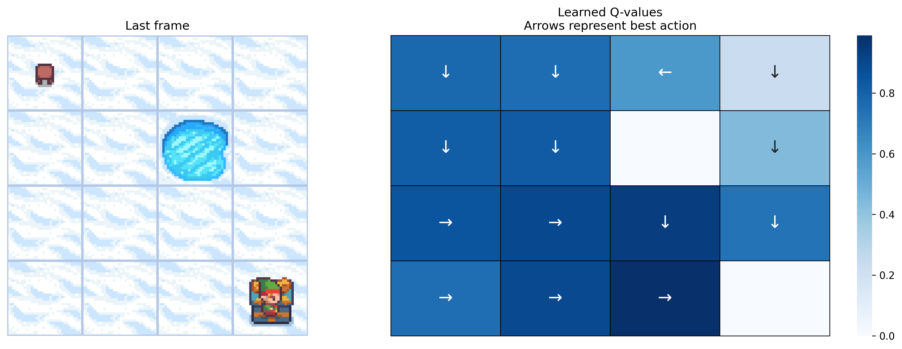
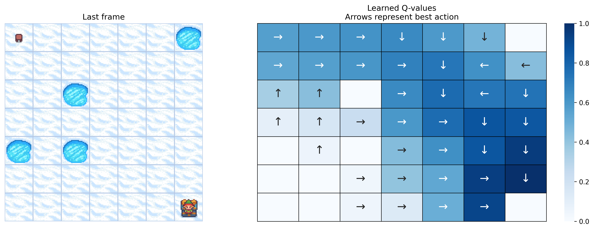
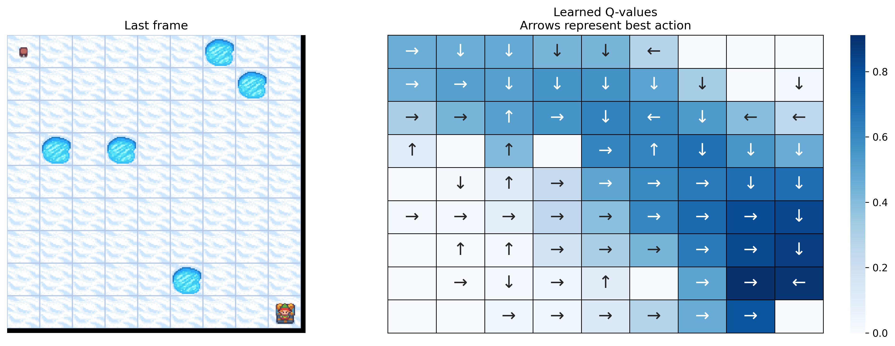
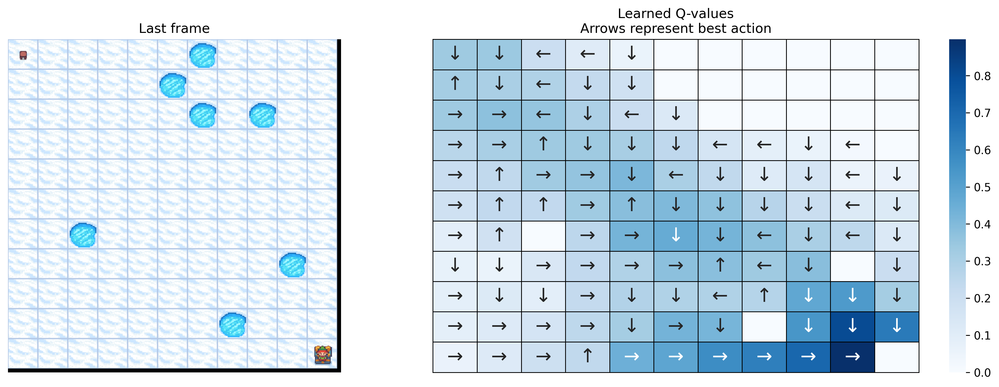
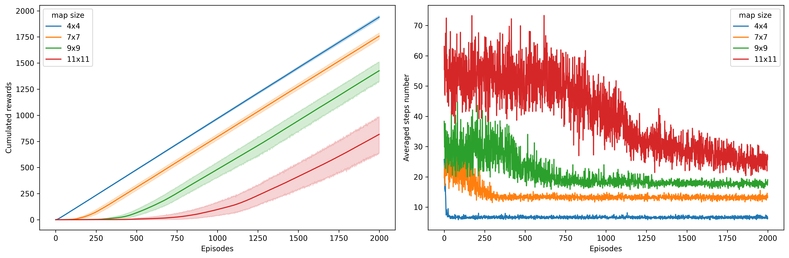
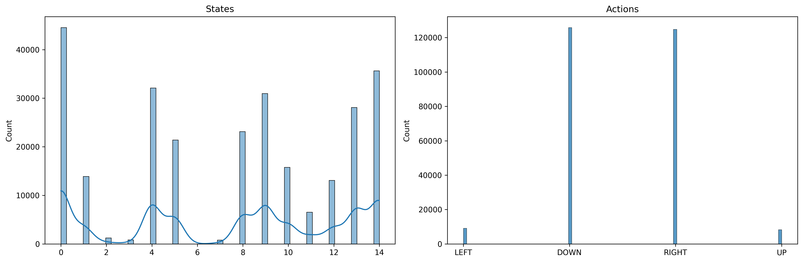
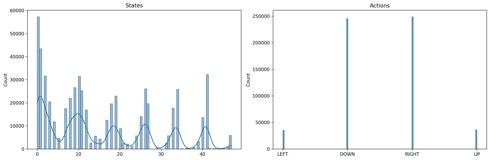
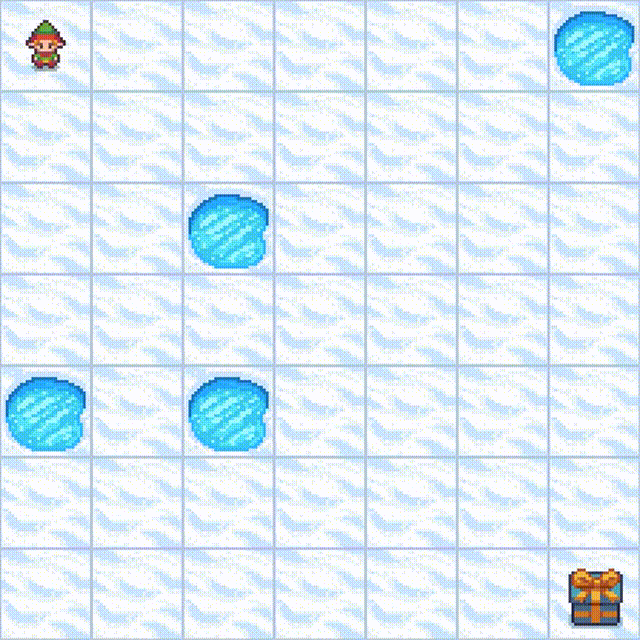

# Q-Learning on FrozenLake Environment

A comprehensive implementation of Q-Learning reinforcement learning algorithm applied to the FrozenLake environment from Gymnasium. This project demonstrates how an agent learns to navigate through a frozen lake to reach the goal while avoiding holes.

## 📖 About

This implementation is based on the official [Gymnasium FrozenLake Q-Learning Tutorial](https://gymnasium.farama.org/tutorials/training_agents/frozenlake_q_learning/#sphx-glr-tutorials-training-agents-frozenlake-q-learning-py). The code has been modularized.

## 🎯 Objective

Train an agent to navigate from the starting position (S) to the goal (G) on a frozen lake grid while avoiding holes (H) using Q-Learning algorithm. The agent receives:

- **+1 reward** for reaching the goal
- **0 reward** for all other moves
- Episode terminates when reaching goal or falling into a hole

## 🏗️ Project Structure

```
rl-frozen-lake/
├── src/
│   ├── params.py           # Configuration parameters
│   ├── environment.py      # Environment setup and wrappers
│   ├── q_learning.py       # Q-Learning algorithm and epsilon-greedy policy
│   ├── run_env.py          # Training execution loop
│   └── visualization.py    # Plotting and analysis functions
├── results/
│   ├── plots/              # Generated visualizations
├── frozen-lake-agent/      # Agent video recordings
├── main.py                 # Main execution script
└── README.md
```

## 🚀 Features

- **Multi-size environments**: Training on 4x4, 7x7, 9x9, and 11x11 grids
- **Comprehensive visualization**: Q-value heatmaps, policy visualization, training curves
- **Statistical analysis**: State visitation and action distribution analysis
- **Video recording**: Automatic recording of training episodes
- **Data export**: CSV files for further analysis
- **Modular design**: Clean, documented, and extensible codebase

## 📊 Results Examples

### Q-Value Heatmaps and Policy Visualization

The agent learns optimal policies for different map sizes. Below are examples of learned Q-values and corresponding policies:

**4x4 Grid:**


**7x7 Grid:**


**9x9 Grid:**


**11x11 Grid:**


### Training Progress Comparison



### State and Action Analysis

Examples of exploration patterns and action preferences:

**4x4 Grid Analysis:**


**7x7 Grid Analysis:**


## 🎥 Video Results

Training videos showing the agent's learning progress are automatically generated and saved in the `frozen-lake-agent/` directory. These videos demonstrate:

- Initial random exploration
- Gradual policy improvement
- Final optimal navigation strategies

### Example Training Video - 7x7 Grid

Watch the trained agent navigate after extensive training (episode 39,000):



This video showcases the agent's learned policy on a 7x7 FrozenLake grid, demonstrating:

- **Optimal pathfinding**: Direct navigation from start (S) to goal (G)
- **Hole avoidance**: Strategic movements around dangerous tiles (H)
- **Policy convergence**: Consistent behavior after 39,000 training episodes
- **Efficient navigation**: Minimal steps to reach the objective

_The video demonstrates the effectiveness of Q-Learning in learning optimal policies for navigation tasks._

## ⚙️ Configuration

Key hyperparameters can be configured in `src/params.py`:

```python
params = Params(
    total_episodes=1000,      # Training episodes per run
    learning_rate=0.1,        # Q-learning step size
    gamma=0.95,               # Discount factor
    epsilon=0.1,              # Exploration probability
    n_runs=10,                # Independent training runs
    # ... other parameters
)
```

## 🔧 Installation & Usage

1. **Clone the repository:**

   ```bash
   git clone https://github.com/vnniciusg/rl-frozen-lake.git
   cd rl-frozen-lake
   ```

2. **Install dependencies:**

   ```bash
   uv sync
   ```

3. **Run the training:**

   ```bash
   uv run main.py
   ```

4. **View results:**
   - Plots are saved in `results/plots/`
   - Data files are saved in `results/`
   - Training videos are saved in `frozen-lake-agent/`

## 📈 Analysis Features

- **Q-Value Visualization**: Heatmaps showing learned state values with policy arrows
- **Training Curves**: Cumulative rewards and episode lengths over time
- **Exploration Analysis**: State visitation frequency and action distribution
- **Multi-Size Comparison**: Performance across different grid sizes
- **Statistical Export**: Raw data for custom analysis

## 🧠 Algorithm Details

**Q-Learning Update Rule:**

```
Q(s,a) ← Q(s,a) + α[R(s,a) + γ max Q(s',a') - Q(s,a)]
```

**Epsilon-Greedy Policy:**

- With probability ε: select random action (exploration)
- With probability 1-ε: select action with highest Q-value (exploitation)

## 📚 Reference

This implementation is based on the official Gymnasium tutorial:

- **Tutorial**: [Training Agents with Q-Learning on FrozenLake](https://gymnasium.farama.org/tutorials/training_agents/frozenlake_q_learning/#sphx-glr-tutorials-training-agents-frozenlake-q-learning-py)
- **Environment**: [FrozenLake-v1](https://gymnasium.farama.org/environments/toy_text/frozen_lake/)

## 📄 License

This project is open source and available under the [MIT License](LICENSE).

---

**Author**: [vnniciusg](https://github.com/vnniciusg)

_Based on the Gymnasium FrozenLake Q-Learning tutorial with extensions for comprehensive analysis and visualization._
